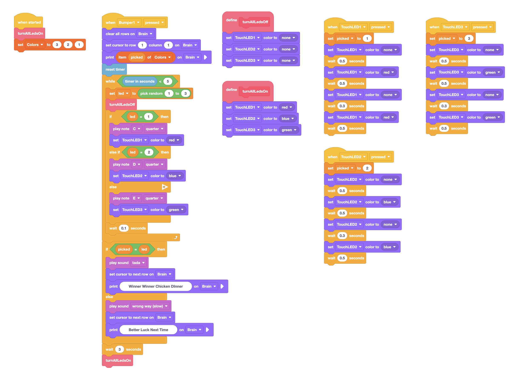
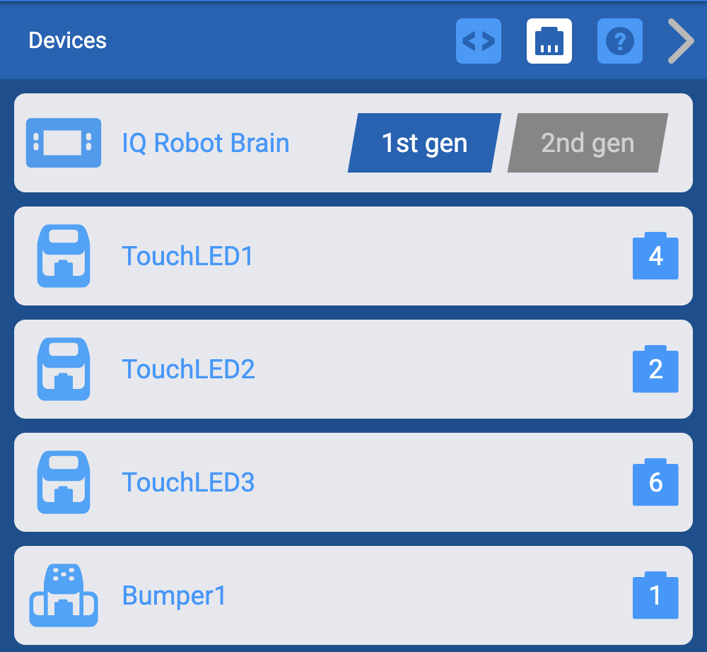

# VEX IQ Candy Randomizer

First, pick your lucky color: will it be vibrant red, cool green, or brilliant blue? Make your choice by tapping the corresponding touch LED.

Now, brace yourself and slam that big yellow button to kick off the fun!

Over the next few thrilling seconds, watch closely as the LEDs flash in a random sequence, each accompanied by a unique tone. Can you keep track of the order? It's a dazzling dance of light and sound designed to playfully tease your brain!

The suspense builds as the final LED stays illuminated... Did you choose wisely? If your initial color pick matches the final glowing LED, prepare for a triumphant burst of a winner song! Get ready to celebrate your sharp memory!

But fear not, even if your guess doesn't align, it's all part of the fun! A lighthearted fail song will play, encouraging you to jump right back in for another round of colorful, musical mayhem!

So, are you ready to put your color recall to the ultimate test? The VEX IQ Color Tone Challenge awaits!

## Download Source
[VEX IQ Block Source Code](./CandyRandomizer.iqblocks)

[VEX IQ Python Source Code]()

## Code
### The Big Picture:

As you can see in the Code Overview image, the code is structured into distinct event-driven blocks that handle different stages of the game, from initial setup to the final outcome and reset.

### Initialization (when started block):

This block sets the initial state of the game.
It starts by turning all three touch LEDs (red, green, and blue) ON. This likely serves as a visual cue during the color selection phase.
Crucially, it initializes a list (or array) called Colors. This array is populated with the three possible color choices: red, green, and blue. This list will be the source from which the random color sequence is generated.

### When Touch LED X pressed (Red, Green, and Blue):

Each of these blocks is triggered when the corresponding touch LED is pressed.
Inside each block, the code records the value (color) of the pressed LED. This represents the user's color selection for the round.
To provide immediate feedback, the pressed LED is then briefly blinked, confirming to the user that their choice has been registered.

### When Bumper pressed:
This block initiates the core gameplay sequence when the bumper button on the VEX IQ brain is pressed.
For the next 5 seconds, a loop runs to generate the color and tone sequence:
Inside the loop, a random LED (red, green, or blue) is selected.
The selected LED is then illuminated, providing the visual element of the sequence.
Simultaneously, a corresponding tone is played, adding the auditory element to the challenge.

This process of randomly selecting an LED and playing a tone repeats until the 5-second duration is over.

### Determining the Outcome: Once the 5 seconds are up:
The code checks if the color the user initially chose (stored when the touch LED was pressed) matches the color of the very last LED that was illuminated in the random sequence.

If there's a match, the triumphant tada sound is played, signaling a win!
If the chosen color doesn't match the final color, the wrong way sound is played, indicating an incorrect guess.

### Game Reset: 
After a 3-second delay, the game automatically resets, returning to the initial state where the touch LEDs are lit, ready for the user to make a new color selection and start another round.

## Setup the Devices

